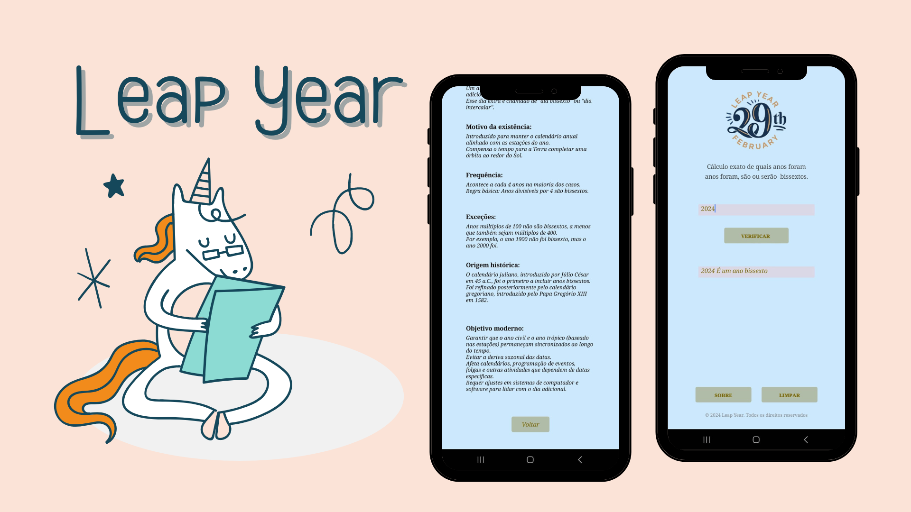

# Determinador de Ano Bissexto

## Descrição
O Determinador de Ano Bissexto é um aplicativo desenvolvido no MIT App Inventor que permite aos usuários verificar se um determinado ano é bissexto ou não.

## Funcionalidades
- Verificação de Ano Bissexto
- Interface Intuitiva

## Como Usar
1. **Abrir o Aplicativo:** Inicie o aplicativo "Determinador de Ano Bissexto" no seu dispositivo.
2. **Inserir o Ano:** Digite o ano que deseja verificar na caixa de entrada fornecida.
3. **Pressionar o Botão "Verificar":** Após inserir o ano, pressione o botão "Verificar".
4. **Visualizar Resultado:** O aplicativo exibirá uma mensagem indicando se o ano é bissexto ou não.

## Como Instalar
1. **Baixar o APK:** Baixe o arquivo APK do aplicativo em [link para download].
2. **Permissões:** Certifique-se de permitir a instalação de aplicativos de fontes desconhecidas nas configurações do seu dispositivo.
3. **Instalar:** Abra o arquivo APK baixado e siga as instruções na tela para concluir a instalação.

## Tecnologias Utilizadas
- MIT App Inventor

## Contribuição e Feedback
Se você tiver ideias para melhorar este aplicativo ou encontrar algum problema, sinta-se à vontade para contribuir ou fornecer feedback.

## Autor
Desenvolvido por Julia.