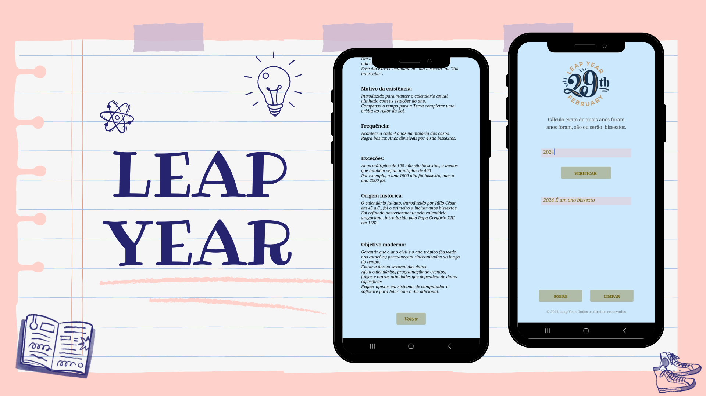

# Leap Year Determiner

## Description
The Leap Year Determiner is an application developed in MIT App Inventor that allows users to check if a specific year is a leap year or not.

## Features
- Leap Year Verification
- Intuitive Interface

## How to Use
1. **Open the Application:** Launch the "Leap Year Determiner" app on your device.
2. **Enter the Year:** Type in the year you want to check into the provided input box.
3. **Press the "Check" Button:** After entering the year, press the "Check" button.
4. **View Result:** The app will display a message indicating whether the year is a leap year or not.

## How to Install
1. **Download the APK:** Download the APK file of the app from [download link].
2. **Permissions:** Make sure to allow installation of apps from unknown sources in your device settings.
3. **Install:** Open the downloaded APK file and follow the on-screen instructions to complete the installation.

## Technologies Used
- MIT App Inventor

## Contribution and Feedback
If you have any ideas to improve this app or encounter any issues, feel free to contribute or provide feedback.

## Author
Developed by Julia.
